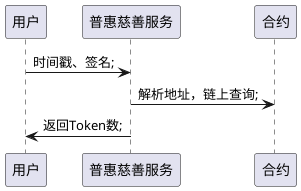
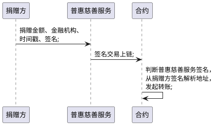
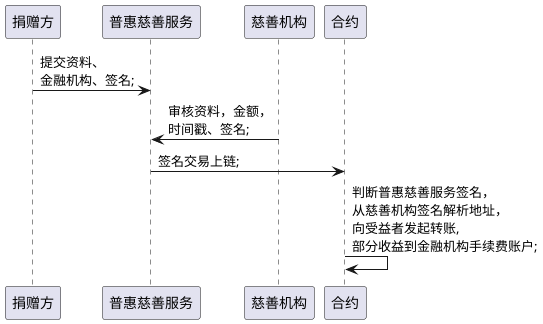

## 概述
本系统主要为慈善基金的链上管理及流转系统，利用区块链公开透明、不可篡改等特点，实现慈善基金的透明管理、缩短慈善基金申领流程。
本系统只涉及资金相关的捐赠与援助，不考虑物资捐赠。

## 角色

### 业务角色
* 公益机构
* 金融机构：本地demo不涉及
* 捐赠方
* 受捐赠方
* 监管方

### 系统角色
* 共识节点：一般由公益机构担任，出块涉及矿工费。
* 观察者节点：一般为监管机构、热心公益的企业或个人，以便于合规监管及公众的监督

## 业务场景

默认用户登录系统时候会统一生成公私钥。本系统不再提供公私钥生成功能。
demo中默认包含：
* 捐赠者用户名、公私钥
* 受益者用户名、公私钥
* 普惠慈善服务公私钥
* 公益机构公私钥

### 一般捐赠
指`捐赠方`向`公益机构`直接进行资金捐赠

### 统筹援助
由`公益机构`对收到的资金进行统筹管理及分配，`公益机构`主动对有困难需要援助的个人或是机构进行慈善基金的分配

### 申请援助
由`受捐赠方`主动向`公益机构`发起申请，并提供相应的证明材料

### 定向捐赠
由`捐赠方`指定捐赠对象，经由`公益机构`转发给`受捐赠方`

## 关键数据流
### 查询

### 捐赠

### 援助

### 援助

### 定向捐赠

### 证书生成
任意`捐赠方`都会收到由区块链生成的，包含区块信息及捐赠数据的证书。

## 合约设计

### 数字货币生成

### 数字货币销毁

### 数字货币转账

